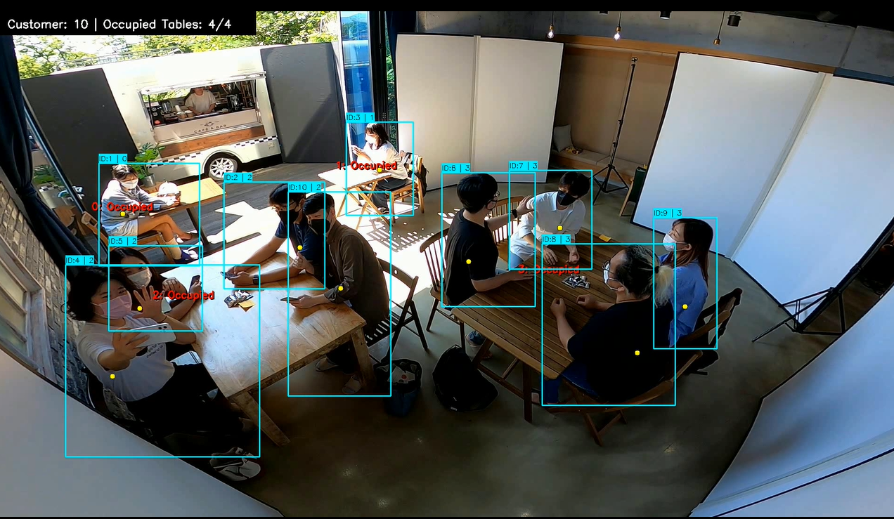
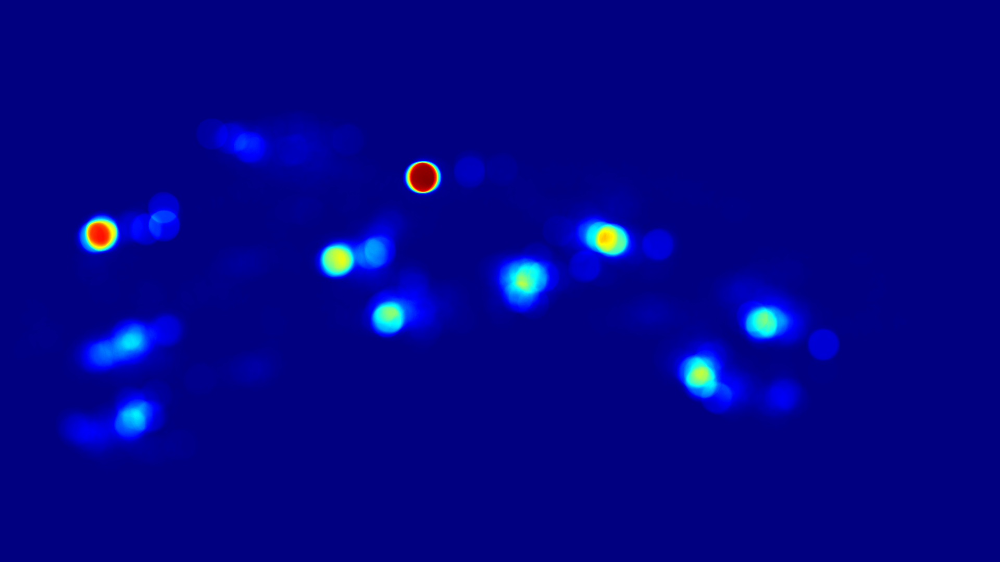
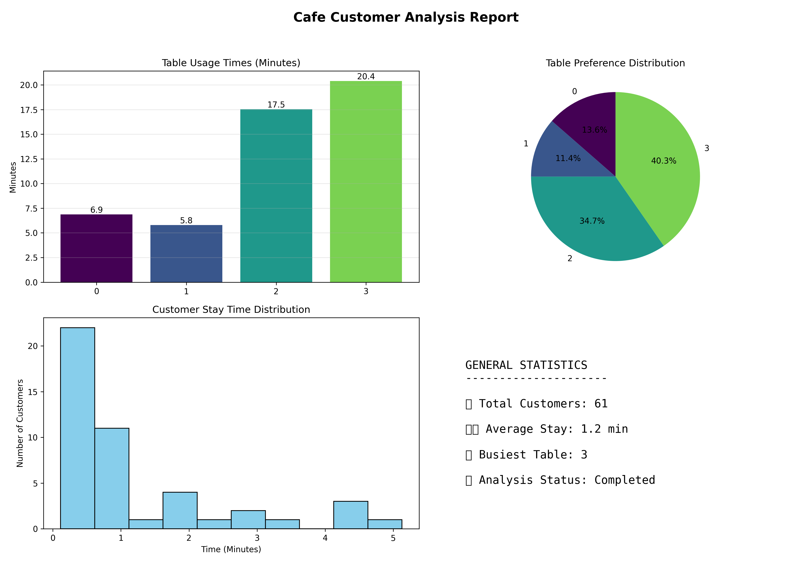
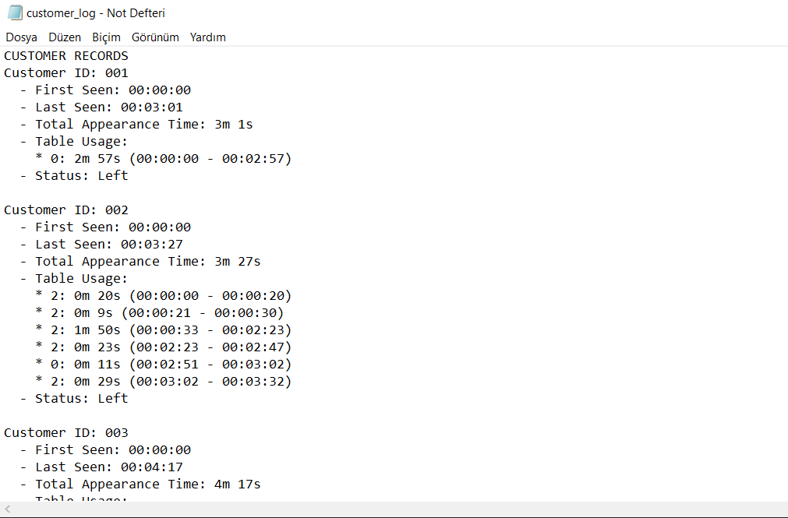
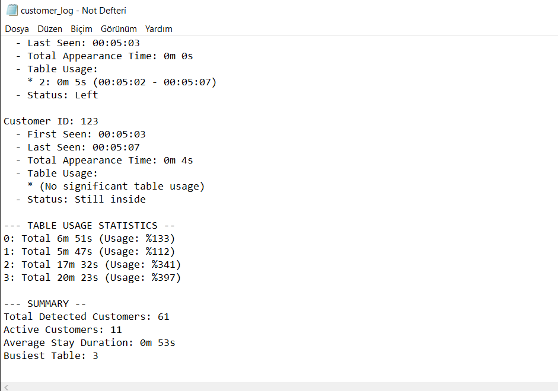

# CafeAnalytics: Cafe Customer Behavior Analysis with Computer Vision

##  Project Overview

**CafeAnalytics** is an advanced computer vision system designed to monitor customer behavior, measure table occupancy durations, and generate spatial density maps (heatmaps) in cafe environments. By transforming raw surveillance footage into structured data, the system provides business owners with critical insights into customer flow and table utilization.

## Installation Steps

Follow these steps to set up the CafeAnalytics environment on your local machine.

### 1. Prerequisites

Ensure you have the following installed on your system:

- **Python**: Required for compatibility with the latest YOLO models and tracking algorithms.
- **Pip**: Python package manager.

### 2. Creating a Virtual Environment

It is highly recommended to use a virtual environment to manage dependencies and avoid version conflicts.

1. Open your terminal in the project's root directory: `C:\Users\user\Desktop\CafeAnalytics`
2. Create the environment:

```bash
python -m venv venv
```

3. Activate the environment:

**Windows:**
```bash
venv\Scripts\activate
```

**macOS/Linux:**
```bash
source venv/bin/activate
```

### 3. Installing Dependencies

The system relies on several high-performance libraries for computer vision and analytical reporting. Install them using the following command:

```bash
pip install ultralytics opencv-python matplotlib numpy
```

**Libraries Included:**

- **ultralytics**: The core engine for YOLOv11-Pose detection and ByteTrack integration.
- **opencv-python**: Used for video stream handling and drawing visual annotations on frames.
- **matplotlib**: Required for generating the 4-quadrant analytical dashboard and reporting charts.
- **numpy**: Utilized for mathematical operations such as midpoint calculation and heatmap matrix management.

### 4. Downloading Model Weights

The system uses the YOLOv11-Pose model for joint detection.

- By default, the script is configured to use `yolo11m-pose.pt`.
- **Automatic Download**: When you run the `main.py` script for the first time, the model weights will be automatically downloaded to the project root directory.

## Usage Instructions

The operation of CafeAnalytics is divided into two distinct phases: Spatial Configuration and Automated Analysis.

### Phase 1: Spatial Mapping (Table ROI Selection)

Before starting the analysis, the system must learn the physical boundaries of the tables in the camera s field of view.

**Launch the Configuration Tool:**

Run the ROI selector script:

```bash
python src/roi_selector.py
```

**Define Table Boundaries:**

- **Place Points**: Use Left Click to mark the corners of a table polygon.
- **Polygon Logic**: Ensure at least 3 points are placed to define a valid area.

**Labeling and Saving:**

- **'N' (New)**: Press 'N' to finish a polygon. You will be prompted in the terminal to enter a name (Table-1).
- **'S' (Save)**: Once all tables are defined, press 'S' to export the mapping to `src/config.json`.
- **'C' (Clear)**: Press 'C' if you need to reset the current points.

### Phase 2: Running the Analytical Engine

Once the `config.json` is prepared, the core engine processes the video to extract behavioral data.

**Execute the Analysis:**

Run the main processing script:

```bash
python main.py
```

**Monitor Live Feedback:**

- **Tracking IDs**: Every detected customer is assigned a unique ID.
- **State Labels**: The display will show whether a customer is "Walking" or currently at a specific table (e.g., "ID:5 | Table-2").
- **Occupancy Counter**: A summary panel at the top displays real-time customer counts and table occupancy ratios (Occupied Tables: 3/6).

### Phase 3: Reviewing Generated Intelligence

After the analysis is complete, the system automatically exports several reports to the `outputs/` directory.

**Termination:**

Press 'q' on your keyboard to stop the video processing and trigger report generation.

**Access Outputs:**

- **customer_log.txt**: Contains granular logs of every customer's entry time, total appearance duration, and specific table sessions.
- **1_heatmap.png**: A spatial density map highlighting the most frequented areas of the cafe.
- **2_dashboard_analiz.png**: A high-level visual dashboard featuring table usage distributions, stay-time histograms, and general occupancy statistics.

## Selected Dataset Information

To validate the accuracy and robustness of the CafeAnalytics system, we utilized a professionally curated academic dataset designed for behavioral analysis.

### 1. Dataset Identity

- **Name**: CAFE (Customer Activity and Feedback Evaluation) Dataset.
- **Official Resource**: dk-kim.github.io/CAFE/.
- **Content**: A high-definition, multi-camera collection of real-world cafe interactions, providing a standardized ground truth for customer tracking and activity recognition.

### 2. Camera Configuration: Camera 11

Among the multiple viewpoints available in the CAFE environment, we specifically selected Camera 11 for the following engineering reasons:

- **Top-Down Diagonal Perspective**: Camera 11 provides a wide-angle, diagonal view from the ceiling. This is the industry standard for modern surveillance, as it captures both walking paths and seating areas simultaneously.

- **Interaction Density**: Camera 11 features a high frequency of "Cross-Walking" events, where customers pass in front of one another. This provided a rigorous testing ground for our ByteTrack association logic and Ghost ID management system.

- **Realistic Environmental Factors**: The lighting conditions and reflections in this view accurately simulate real-world cafe environments, testing the model's ability to maintain high confidence levels under varying visual noise.

## Algorithm Explanation

This project implements a multi-layered analytical pipeline that translates raw video frames into structured behavioral data. The following sections detail the engineering logic behind each component.

### 1. Spatial Geometry: Polygon ROI Management

To monitor specific areas, we transitioned from standard rectangular bounding boxes to **Polygon ROIs**.

- **The "Why"**: Standard rectangles cannot account for the perspective distortion inherent in surveillance cameras. Polygons allow for precise mapping of table boundaries regardless of the camera angle.
- **Implementation**: The system utilizes the `cv2.pointPolygonTest` function. It determines if a specific coordinate is inside, outside, or on the edge of the defined table area by calculating the shortest distance between the point and the polygon contours.

### 2. Pose-Based Reference Point Logic

Traditional tracking often uses the center of a bounding box, which fails when a customer's lower body is obscured by a table. Our solution utilizes **YOLOv11-Pose** to compute a stable "Abdomen-Level" reference point.

- **Model**: We utilize `yolo11m-pose.pt`, which identifies 17 human joints.
- **Torso Computation**: The system identifies the left shoulder (S_L) and right shoulder (S_R).
- **Abdomen Projection**: To find the optimal point for table interaction, we calculate the midpoint and apply a **25% vertical offset** relative to the bounding box height.


- **Fallback Logic**: If shoulder detection confidence is below **50% (0.5)**, the system dynamically switches to a geometric fallback: a point located at the horizontal center and **40% from the top** of the bounding box to ensure tracking continuity even when the torso is partially hidden.

### 3. Temporal Tracking with ByteTrack

The system integrates **ByteTrack** for high-performance object association without the computational overhead of ReID models.

**Custom Parameter Selection:**

- **`track_high_thresh` (0.5) / `track_low_thresh` (0.1)**: This dual-thresholding allows the system to maintain tracks even for "low-score" detections.
- **`track_buffer` (150)**: We set the buffer to 150 frames. At 30 FPS, this equals **5 seconds**. This value was chosen to ensure that a customer who is momentarily blocked by a passing waiter is not assigned a new ID.
- **`match_thresh` (0.8)**: A high matching threshold ensures that associations are only made when there is a strong spatial overlap or motion consistency.

### 4. Identity Stabilization & Ghost ID Logic

To achieve graduation-level precision, we implemented a custom stabilization layer in `analyzer.py`.

- **Ghost ID Memory**: When an ID is lost, it is stored in a **Ghost State** for a Time-to-Live of **5.0 seconds**.
- **Multi-Factor Merging**: If a new detection appears, the system checks multiple criteria before merging it with a Ghost ID:
  - **Distance**: Must be within **60 pixels**.
  - **Velocity Consistency**: The system compares the previous motion vector with the current one using a dot product; if the direction change is too abrupt (cosine angle < 0.5), the merge is rejected.
  - **Appearance (Color) Check**: The system extracts the mean BGR color of the detection ROI. If the color difference exceeds a threshold of **50**, it is treated as a new person.
- **Patience Mechanism**: A table is not marked "Free" immediately upon detection loss. A **5-second patience counter** keeps the session active to filter out momentary tracking flickers.

### 5. Occupancy Detection & Duration Analysis

- **Intersection Logic**: A customer is considered "at a table" if their computed abdomen point is within the table's polygon ROI.
- **Duration Threshold**: To prevent "false seating" (like someone just walking past a table), the system requires a minimum stay of **4.0 seconds** before recording a valid table session in the `customer_log.txt`.

### 6. Spatial Intelligence: Heatmap Accumulation

The system generates a spatial density map to visualize cafe traffic.

- **Method**: We use a `heatmap_accum` matrix of the same size as the video frame.
- **Accumulation**: For every frame, a small "heat circle" is added to the matrix at the person's location.
- **Visualization**: At the end of the analysis, the matrix is normalized to 0-255 and mapped to the **`COLORMAP_JET`**. This converts low-density areas to **Blue**  and high-density stay areas to **Red** .

### 7. Real-Time Visualization & Rendering

- **Bounding Boxes**: Rendered with ID and current state ("Walking" or table name).
- **Visual Anchors**: A **Yellow Point** is drawn at the stomach level to show the exact point used for ROI collision detection.
- **Information Panel**: A top-left dashboard displays the current customer count and a "Dolu/Boş" ratio for the tables.


## Challenges Encountered & Solutions

The development of **CafeAnalytics** involved overcoming several technical hurdles common in complex indoor surveillance environments. Below is a detailed breakdown of the engineering challenges we faced and the strategic decisions implemented to address them.

### 1. Identity Fragmentation and ID Switching
* **The Challenge**: In a dense cafe environment, customers frequently pass in front of each other or behind furniture, causing the tracking algorithm to lose the original ID and assign a new one upon reappearance.
* **Attempted Solution (Re-ID)**: We initially explored **BoT-SORT with Re-ID** (Appearance-based Re-identification) to match identities. However, Re-ID models proved computationally heavy and often failed due to similar clothing colors among different customers.
* **Current Engineering Solution**: We moved to a "geometry and motion" first approach using **ByteTrack** with a high `track_buffer` (150 frames/5 seconds) to maintain identity through short occlusions.
* **Advanced Stabilization**: We implemented a custom **Ghost ID Memory** and **Patience Mechanism**. If a track is lost, the system holds its state for 5 seconds and attempts to merge it with new detections based on spatial proximity and velocity consistency.

### 2. Table-Height Occlusion and ROI Mapping
* **The Challenge**: Standard bounding box centers or foot-point tracking became useless once a customer sat at a table, as their lower body disappeared from the camera's view.
* **Exploration (Morphology & Bird's Eye View)**: We experimented with **Morphological transformations** and **Bird’s Eye View (Perspective Warping)** to create a top-down floor map for better spatial awareness.
* **Final Implementation**: We transitioned to **Pose-Based Torso Reference Points** using YOLOv11-Pose. By calculating the midpoint between shoulders and applying a vertical offset, we created a reference point that remains visible above the table line.

### 3. Future Outlook: Instance Segmentation
* **Limitation**: While Polygon ROIs are highly accurate for flat surfaces, they do not perfectly capture the 3D interaction between a human and a chair/table.
* **Potential Solution**: We considered moving toward **Instance Segmentation**. Using masks instead of boxes would allow for pixel-level intersection checks between the person and the table, further reducing "false seating" events currently managed by the **4.0s Duration Threshold**.

---

| Feature | Current Solution | Status |
| :--- | :--- | :--- |
| **Tracker** | ByteTrack (Geometric & Motion consistency) | Fully Implemented |
| **Stability** | Ghost ID & Patience Buffers | Fully Implemented |
| **Geometry** | Multi-point Polygon ROIs | Fully Implemented |
| **Reference** | Torso-level pose projection | Fully Implemented |

##  Visual Outputs

The system provides a comprehensive visual and data-driven suite to validate the analysis. Below are the core outputs generated throughout the pipeline:

### 1. ROI Selection Interface
The initial configuration step where table boundaries are manually mapped using the custom GUI to account for camera perspective distortion.


### 2. Real-Time Video Processing
The live analysis engine in action, displaying unique tracking IDs, pose-based torso reference points (yellow dots), and real-time occupancy labels.


### 3. Spatial Heatmap
A density map generated at the conclusion of the video using the `JET` colormap. Red zones indicate high-traffic seating areas, while Blue zones represent low-activity regions.


### 4. Analytical Dashboard
A comprehensive 4-quadrant visual report generated via Matplotlib. This includes table usage bar charts, preference distribution pie charts, stay-time histograms, and general occupancy statistics.In the table use time graph, the total sitting time of individual people is taken as the total sitting time at the table.


### 5. Detailed Activity Logs
A granular text-based report (`customer_log.txt`) providing specific entry/exit times, total duration in frame, and chronological table session data for every unique customer.




